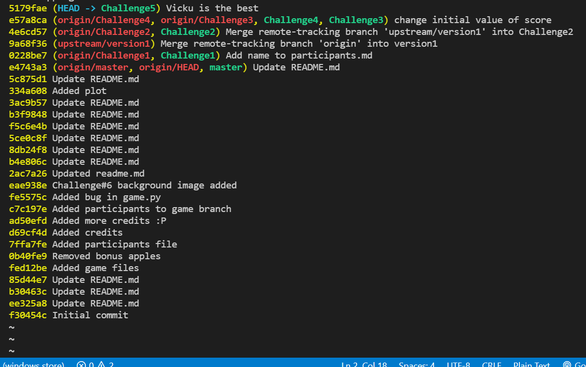

# Challenge1
Added name to participants.md
```
git clone https://github.com/sarvesh543/GitHero_2022.git
git checkout -b Challenge1
git add .                      //added name before this
git push origin Challenge1
```

# Challenge2
```
git checkout -b Challenge2
git add remote upstream "https://github.com/KamandPrompt/GitHero_2022"
git fetch upstream version1
git merge upstream/version1
git push origin Challenge2
```
## logs of last three commits


# Challenge3
```
git checkout -b Challenge3
// changed initial value of score to 0 in game .py
git add .
git commit -m "change initial value of score"
git push origin Challenge3
```
changed initial value of score to 0 in game.py

# Challenge4
```
git checkout -b Challenge4
//noted the hash = e57a8ca4ce3faa64160875a50d75a7ebaede0db2
git reset HEAD~1
git diff Challenge4..Challenge3
git reset e57a8ca4ce3faa64160875a50d75a7ebaede0db2
```
## git diff output


## git log oneline


# Challenge5
```
// created Vicku.txt
git add .
git commit -m "Vicku is the best"
// add "Sorry Vicku" to Vicku.txt
git add .
git commit -m "Vicku is the best"
// add "Please forgive me" to Vicku.txt
git add .
git commit -m "Vicku is the best"
// add "Don't reward us with an F" to Vicku.txt
git add .
git commit -m "Vicku is the best"

```
## before rebase


```
git reset HEAD~1
git restore Vicku.txt  // to drop last commit
```
```
git -i rebase HEAD~3      // to rebase remaining 3 commits
git push origin Challenge5
```

rebased the remaining 3 commits

## after rebase


# Challenge6
```
// changed background2.jpg to iit-mandi.jpg in cfg.py in same challenge5 branch
git stash save "change background image to iit-mandi.jpeg"
git checkout -b Challenge6
git stash pop
git stash list
git commit -m "change background2.jpg to iit-mandi.jpg"
```

## git diff of changes


## console window showing commands


# Challenge7
```
git checkout -b Challenge7
git fetch upstream challenge-7
git merge upstream/challenge-7
// resolved conflicts
git commit -m "merge paddu's background image"
git push origin Challenge7
```

fetched ,merged and commited new background into Challenge7 branch

## console screenshot of fetch, merge and commit


# Game Screenshots 


