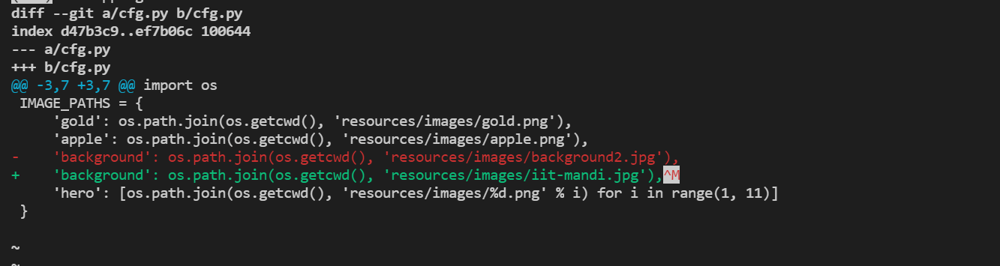

# Challenge1
Added name to participants.md

# Challenge2
## logs of last three commits

# Challenge3
changed initial value of score to 0 in game.py

# Challenge4
## git diff output

## git log oneline

# Challenge5
## before rebase

used
* git reset HEAD~1
* git restore Vicku.txt
to drop last commit

rebased the remaining 3 commits with "git rebase -i HEAD~3"

## after rebase

# Challenge6
changed background2.jpg to iit-mandi.jpg in cfg.py in same challenge5 branch

## git diff of changes

used "git stash save message" and "git stash pop" to transfer changes to new branch

## console window showing commands

# Challenge7
checkout to new branch as usual

fetched ,merged and commited new background into Challenge7 branch

## console screenshot of fetch, merge and commit

# Game Screenshots 

